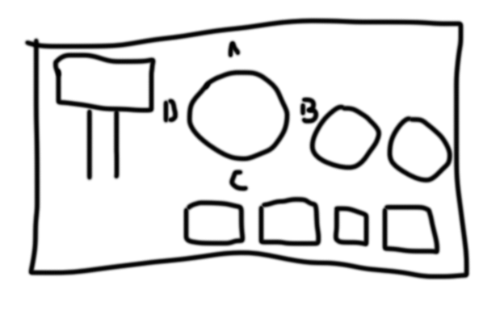

# About Panel

The panel project involves the creation of a central control panel for the BrickMMO project.

# Panel Structure

# Contributors

| Avatar                                                                      | Name         | Link                           |
| --------------------------------------------------------------------------- | ------------ | ------------------------------ |
|   | Bailey Liang | https://github.com/bingjetli   |
|  | Yousuf Abbas | https://github.com/Skinnygoose |

# Technologies Used

 

---

# Repo Resources

-  [BrickMMO](https://www.brickmmo.com/)
-  [BrickMMO Panel](https://panel.brickmmo.com/)

